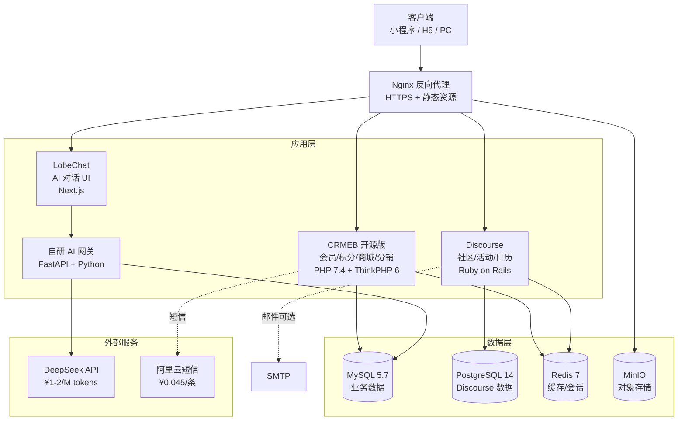
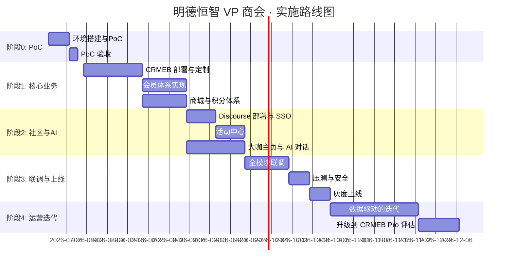

# 明德恒智 VP 商会 · 纯开源搭建方案 v1.0

> **创建日期**：2026-07-17
> **文档状态**：可执行方案（可直接交付开发团队或外包）
> **演进策略**：先用纯开源起步 → 验证商业模型 → 有稳定收入后平滑升级到 CRMEB 商业版
> **核心原则**：架构设计提前预留升级路径，避免未来"推倒重来"

---

## 0. 执行摘要（TL;DR）

| 项目 | 内容 |
|---|---|
| **核心选型** | CRMEB 开源版 + Discourse 自托管 + LobeChat + UniApp + DeepSeek API |
| **软件授权费** | **¥0**（全部 Apache-2.0 / GPLv2 自托管） |
| **首年总投入** | **9.75 - 13.3 万元**（含一次性人力） |
| **实施周期** | 4-6 个月（1 名全栈） / 2-3 个月（2-3 人小团队） |
| **可上线 PoC** | **2 周**（核心 1-2 个场景验证） |
| **升级 Pro 触发** | 月 GMV > 5 万 / 付费会员 > 200 / 月活 > 5000 |

---

## 1. 演进路线图（开源 → 商业版）

### 1.1 三阶段渐进式交付

```
[阶段 0: PoC 验证]  →  [阶段 1: 完整开源版]  →  [阶段 2: 升级商业版]
   2 周                4-6 个月                   按需触发
  ¥0 - 500             ¥9-13 万                  ¥1-3 万/年
```

### 1.2 升级触发条件（满足任一即应考虑升级）

| 指标 | 阈值 | 原因 |
|---|---|---|
| 月 GMV | > 5 万元 | 需要 SCRM、订单分析、营销自动化 |
| 付费会员 | > 200 人 | 需要稳定的客服系统、分销结算 |
| 月活用户 | > 5000 | 单服务器性能到达瓶颈 |
| 直播/多门店 | 有需求 | 开源版不支持，需 Pro 版 |
| 团队人数 | > 3 人需要协作 | 开源版无内置 OA/审批 |

### 1.3 平滑迁移路径（开源版 → Pro 版）

由于开源版与 Pro 版同属 CRMEB 体系（同一厂商），迁移成本远低于"换框架"：

| 维度 | 迁移难度 | 说明 |
|---|---|---|
| 数据库 | ⭐⭐ | MySQL → MySQL，CRMEB 自带 `crmeb-upgrade` 迁移脚本 |
| UI / 接口 | ⭐ | 100% 兼容，无须改前端 |
| 业务数据 | ⭐ | 用户 / 订单 / 积分 / 会员等级全部继承 |
| 新功能启用 | ⭐ | Pro 功能以"模块开关"形式启用，无须重构 |
| 自研部分 | ⭐⭐⭐ | AI 后端、社区模块独立部署，不受影响 |

### 1.4 预规避要点（现在就为未来铺路）

- ✅ **数据表预留扩展字段**：不要硬编码业务字段，每个核心表加 `_ext` JSON 字段
- ✅ **自研模块走独立服务 + API 网关**：避免耦合 CRMEB 核心表
- ✅ **关键业务表加 `source` 字段**：区分"开源版字段"和"Pro 版字段"，升级时数据合并不冲突
- ✅ **配置文件与代码分离**：方便后期覆盖
- ✅ **关键 API 走自研 Gateway**：不直接绑定 CRMEB Controller，未来可平滑替换后端

---

## 2. 架构设计

### 2.1 整体架构图



### 2.2 单点登录（SSO）流程

由于 Discourse 与 CRMEB 是两套独立系统，必须实现 SSO：

```
用户登录 CRMEB → CRMEB 生成 JWT → 跳转到 Discourse 带 token →
Discourse 自定义插件验证 JWT → 自动登录
```

- **预研工作量**：1 周（已有开源 `sso-discourse` 插件可参考）
- **反向同步**：用户在 Discourse 修改昵称/头像 → Webhook → 同步到 CRMEB

### 2.3 技术栈清单

| 层 | 组件 | 版本 | 许可证 | 商用限制 |
|---|---|---|---|---|
| 会员 / 积分 / 商城 | CRMEB 开源版 | v5.x | Apache-2.0 | ✅ 可商用 |
| 社区 / 活动 | Discourse | latest stable | GPLv2 | ⚠️ 自用可，禁止 SaaS 转售 |
| 日历插件 | discourse-calendar | latest | GPLv2 | 同上 |
| AI 对话前端 | LobeChat | latest | Apache-2.0 + 附加条款 | ⚠️ 不改源码可商用 |
| 小程序 / H5 | UniApp（CRMEB 自带） | - | Apache-2.0 | ✅ 可商用 |
| AI 后端 | 自研 FastAPI | - | 自有代码 | ✅ 自主可控 |
| AI 大模型 | DeepSeek API | - | 商业 API | ¥1-2/M tokens |
| 数据库 | MySQL 5.7 | - | GPL | ✅ 可商用 |
| 数据库 | PostgreSQL 14 | - | BSD | ✅ 可商用 |
| 缓存 | Redis 7 | - | BSD | ✅ 可商用 |
| 对象存储 | MinIO | - | Apache-2.0 | ✅ 可商用 |
| 部署 | Docker Compose + Nginx | - | - | - |

---

## 3. 五大模块实现方案

### 3.1 模块 1：活动中心

| 子功能 | 实现方式 | 工作量 |
|---|---|---|
| 活动日历 | Discourse Calendar 插件 | 0（直接装） |
| 活动发布 | Discourse 后台 | 0.5 天 |
| 扫码签到 | 自研 H5 页面 + CRMEB 二维码 API | 3 天 |
| 报名限制 | Discourse Calendar 容量限制 | 0.5 天 |
| 活动提醒 | Discourse 内置邮件 + 自研微信模板消息 | 2 天 |

**关键调整**：原文档建议"所有功能在 Discourse 实现"——保留 Discourse 用于内容沉淀，但**签到业务走 CRMEB**（避免 Discourse 不能对接微信模板消息的痛点）。

### 3.2 模块 2：会员体系（⚠️ 原文档最大误用区）

| 子功能 | 实现方式 | 说明 |
|---|---|---|
| L1-L4 等级 | **CRMEB 付费会员 + 等级会员** | ⭐ 替代 Discourse Trust Level（活跃度自动升降，不能映射"花钱买等级"） |
| 好友申请 | CRMEB 分销关系（推荐绑定） | 不是传统"好友"，而是"上下级推荐" |
| 积分体系 | CRMEB 积分（订单返积分、签到送积分） | 原生支持 |
| 分销码 | CRMEB 渠道码 + 分销裂变 | 自动生成、统计、佣金结算 |
| 会员权益 | CRMEB 付费会员卡（折扣、专属客服、专享活动） | 原生支持 |

**关键差异**：原文档把会员体系放在 Discourse 实现，**这是 Discourse 的最大误用**——Discourse 的 Trust Level 是社区贡献度评分（用于反垃圾），不是商业会员等级。

### 3.3 模块 3：积分商城

| 子功能 | 实现方式 |
|---|---|
| 商品展示 | CRMEB 标准商城 |
| 积分 + 现金混合支付 | CRMEB 原生（订单可设置"积分抵现比例"） |
| 订单管理 | CRMEB 原生 |
| 库存管理 | CRMEB 原生 |
| 物流跟踪 | CRMEB 原生（已对接快递 100） |

**关键收益**：**避免 iframe 嵌套割裂**——商城和小程序是同一套数据，体验流畅。

### 3.4 模块 4：大咖主页

| 子功能 | 实现方式 |
|---|---|
| 大咖主页展示 | CRMEB 商户入驻 + 自定义模板 |
| AI 对话 | LobeChat + 自研 FastAPI（DeepSeek 驱动） |
| 付费预约 | CRMEB 商品类型 = "服务" + 预约时间字段 |
| 内容沉淀 | Discourse 标签：大咖名 + AI 对话记录归档 |
| 客户评价 | Discourse Comments 插件嵌入 |

### 3.5 模块 5：AI 生态

| 子功能 | 实现方式 |
|---|---|
| AI 咨询 | LobeChat + DeepSeek，按 token 计费 |
| 工具调用 | FastAPI 实现 Function Calling（订单查询、活动推荐、积分兑换） |
| 知识库 | 商会内部文档 → 向量化 → 存入 Milvus（开源向量数据库） |
| AI 陪跑 | 多轮对话记忆 + 用户画像（来自 CRMEB） |

**AI 成本估算**：
- DeepSeek API：¥1-2/M tokens（输入）/ ¥2-8/M tokens（输出）
- 单次深度对话：约 ¥0.01-0.05
- 1000 次深度对话/月：约 ¥10-50
- 含知识库检索：增加 2-5 倍

---

## 4. 真实成本拆解

### 4.1 首年成本明细

| 项目 | 金额 | 备注 |
|---|---|---|
| **软件授权** | **¥0** | 全部开源 |
| 服务器（2 核 4G × 2） | ¥300/月 × 12 = ¥3,600 | 阿里云/腾讯云 |
| OSS 对象存储 | ¥50/月 × 12 = ¥600 | 图片/文件 |
| 数据库 RDS | ¥200/月 × 12 = ¥2,400 | 可选，用云数据库更稳 |
| SSL 证书 | ¥0 | Let's Encrypt 免费 |
| 域名 | ¥100/年 | .com 域名 |
| DeepSeek API | ¥50-500/月 × 12 = ¥600-6,000 | 按用量 |
| 短信 | ¥0.045/条 × 估 5,000 条 = ¥225 | 验证码、通知 |
| 邮件 | ¥0 | Discourse 用 SMTP，可对接免费企业邮箱 |
| **服务器/API 小计** | **¥7,500-13,000/年** | |
| | | |
| **开发人力（一次性）** | | |
| 全栈工程师 1 人 × 6 个月 | ¥15,000/月 × 6 = ¥90,000 | 一线城市市场价 |
| 或 2-3 人小团队 × 3 个月 | ¥40,000/月 × 3 = ¥120,000 | 含 UI/前端/后端 |
| **小计** | **¥90,000-120,000（一次性）** | |
| | | |
| **首年总计** | **¥9.75-13.3 万** | |

### 4.2 与原文档估算对比

| 项目 | 原文档估算 | 真实成本 | 偏差 |
|---|---|---|---|
| 月度成本 | ¥200/月 | ¥650-1,100/月（不含人力） | **3-5 倍** |
| 首年总成本 | 未提及 | ¥10-13 万（含人力） | - |
| 实施周期 | 8-10 周 | 4-6 个月 | **2-3 倍** |

### 4.3 5 年 TCO 对比表

| 方案 | 5 年总成本 | 优点 | 缺点 |
|---|---|---|---|
| **本方案（开源版）** | **¥15-20 万** | 一次投入，数据自主 | 需要技术团队维护 |
| 本方案 + 后期升级 Pro | ¥15 万 + ¥5-15 万 = ¥20-30 万 | 灵活演进 | 仍需升级时迁移 |
| CRMEB Pro 商业版（一次性） | ¥20-30 万 + 人力 | 厂商支持 | 仍需开发定制功能 |
| 微擎 / 有赞 等 SaaS | ¥30-100 万 | 开箱即用 | 数据被锁定，年费持续上涨 |

---

## 5. 风险清单与应对

| 风险 | 等级 | 应对措施 |
|---|---|---|
| Discourse Ruby 国内开发者稀缺 | 🟡 中 | 招聘时考虑远程 / 外包 Ruby 工程师 |
| CRMEB 开源版不含 SCRM / 直播 / 多门店 | 🟡 中 | 用第三方工具补位，或升级 Pro |
| Discourse 不支持小程序原生 | 🟠 中高 | 小程序内嵌 Discourse H5 页面 |
| SSO 单点登录需 1 周开发 | 🟢 低 | 已有成熟方案 |
| 小程序审核"社交-社区"类目有被拒风险 | 🟠 中高 | 内容先经人工审核，或以"工具+社区"类目上架 |
| LobeChat 商用条款限制（不改源码可商用） | 🟢 低 | 不改 LobeChat 源码，只对接 API |
| 团队对 Discourse 不熟悉 | 🟡 中 | 前 2 周安排培训 / 阅读官方文档 |
| 自研 AI 后端工作量低估 | 🟡 中 | PoC 阶段先验证 1-2 个工具调用场景 |

---

## 6. 实施路线图

### 6.1 甘特图



### 6.2 关键里程碑

| 里程碑 | 日期 | 验收标准 |
|---|---|---|
| PoC 完成 | 2026-08-01 | 2 个核心场景跑通 |
| 核心业务上线 | 2026-09-30 | 会员 / 积分 / 商城可用 |
| 全功能上线 | 2026-11-30 | 5 大模块全部交付 |
| 运营 1 个月 | 2026-12-30 | 收集反馈，准备升级评估 |

---

## 7. 2 周 PoC 验证清单（⭐ 推荐先做）

> **目的**：用最小投入验证技术可行性，避免全面投入后才发现走不通

### 7.1 PoC 范围（只做 2 个核心场景）

| 场景 | 验证点 | 工作量 |
|---|---|---|
| 场景 1：用户注册 → 购买会员 → 查看权益 | CRMEB 核心流程 | 3 天 |
| 场景 2：CRMEB 用户 → 跳转 Discourse → 自动登录 | SSO 方案 | 4 天 |

### 7.2 PoC 不做的事

- ❌ UI 美化（先丑后美）
- ❌ 全部模块（只验证最关键的 1 个核心流程 + 1 个集成点）
- ❌ 性能优化（PoC 阶段 10 个用户够用）
- ❌ 完整测试（手工跑通就行）

### 7.3 PoC 验收标准

- [ ] CRMEB 开源版能在 Docker Compose 中一键启动
- [ ] Discourse 能在 Docker Compose 中一键启动
- [ ] SSO 跳通：用户在 CRMEB 登录后跳 Discourse 不需要再输入密码
- [ ] DeepSeek API 能正常调用，响应延迟 < 5s
- [ ] 一份 `README.md` 记录部署步骤，团队任意成员按文档 1 小时内可复现

### 7.4 PoC 失败止损线

如果在 2 周内 PoC 未通过，应立即止损：
- **SSO 失败** → 考虑换 Discourse 为自研简易社区（如 NodeBB）
- **CRMEB 文档不清晰** → 考虑换微擎（PHP 微信生态成熟）
- **AI 集成复杂度高** → 推迟 AI 模块，先做核心业务

### 7.5 PoC 阶段产出物

1. 一套 `docker-compose.yml`（一键启动全部依赖）
2. 一份 `README.md`（含部署步骤、常见问题 FAQ）
3. 一个 demo 演示视频（5-10 分钟）
4. PoC 验收报告（Go / No-Go 决策）

---

## 8. 团队配置建议

### 8.1 最小团队（1 人，6 个月）

| 角色 | 技能要求 | 投入 |
|---|---|---|
| 全栈工程师 | PHP（CRMEB）+ Ruby（Discourse）+ Python（AI 后端）+ Vue/UniApp | 100% |

⚠️ **风险高**：单一工程师一旦离职项目停摆，建议至少配 2 人。

### 8.2 推荐团队（2-3 人，3 个月）

| 角色 | 人数 | 技能要求 |
|---|---|---|
| PHP 后端 | 1 | CRMEB 定制、ThinkPHP |
| 前端 | 1 | UniApp、小程序 |
| AI / 全栈 | 1 | Python、FastAPI、Vue |

### 8.3 外包团队（如果自建团队困难）

| 评估项 | 询问外包的问题 |
|---|---|
| CRMEB 二次开发经验 | 做过哪些 CRMEB 定制案例（要求看截图/演示） |
| Discourse 运维 | 是否熟悉 Ruby on Rails，能否接手运维 |
| AI 集成 | 做过哪些 LLM 应用，是否熟悉 Function Calling |
| 数据迁移 | 是否能从其他系统迁移到 CRMEB |
| 价格模式 | 全包价 vs 人月价，超出范围如何计费 |
| 后续维护 | 上线后是否提供运维服务，费用多少 |

---

## 9. 后续升级评估流程

### 9.1 升级触发后做什么

1. **数据快照**：用 `mysqldump` 备份当前完整数据库
2. **购买 Pro 授权**：在 CRMEB 官网购买对应模块授权
3. **执行迁移脚本**：CRMEB 提供 `crmeb-upgrade` 工具
4. **功能开关启用**：在后台启用 Pro 功能（直播、SCRM 等）
5. **回归测试**：确保原业务不受影响
6. **灰度上线**：先 10% 用户测试，无异常后全量

### 9.2 升级成本预估

| 项目 | 费用 |
|---|---|
| Pro 商业版授权 | ¥10,000-30,000/年（按模块） |
| 数据迁移 | 1 周（1 名工程师） |
| 功能培训 | 2-3 天（厂商提供） |
| 回归测试 | 1 周 |
| **升级总成本** | **¥1-3 万 + 2-3 周时间** |

### 9.3 不升级也可以走的路

如果升级到 Pro 不划算，也可以：
- **横向扩展**：用多个第三方 SaaS 补齐缺失功能（如客服用智齿、直播用保利威）
- **混合架构**：核心用开源版 + 个别模块单独购买（如只买 SCRM 模块）
- **数据驱动决策**：用数据说话——如果 ROI 不高，就保持开源

---

## 10. 附录

### 10.1 参考资源

- CRMEB Gitee：https://gitee.com/ZhongBangKeJi/CRMEB
- CRMEB 官方文档：https://doc.crmeb.com
- Discourse 官网：https://www.discourse.org
- Discourse GitHub：https://github.com/discourse/discourse
- LobeChat GitHub：https://github.com/lobehub/lobe-chat
- DeepSeek 开放平台：https://platform.deepseek.com

### 10.2 文档变更记录

| 版本 | 日期 | 变更 |
|---|---|---|
| v1.0 | 2026-07-17 | 初版，基于纯开源方案 + 渐进式升级路径 |

---

## 附：方案核心要点速记卡

> **如果只能记住 3 件事**：
>
> 1. **软件免费 ≠ 零成本**：首年 ¥10-13 万（含人力），不是原文档说的 200 元/月
> 2. **架构设计 = 升级路径**：现在预留扩展字段、API 网关，未来升级 Pro 不重写
> 3. **先 PoC 再投入**：2 周投入验证 SSO + 核心流程，避免 4 个月后才发现走不通